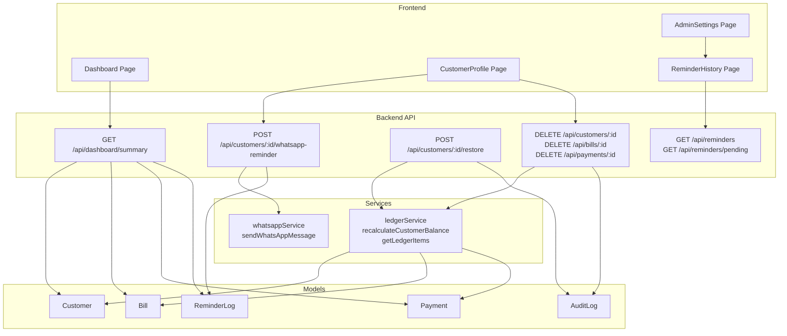
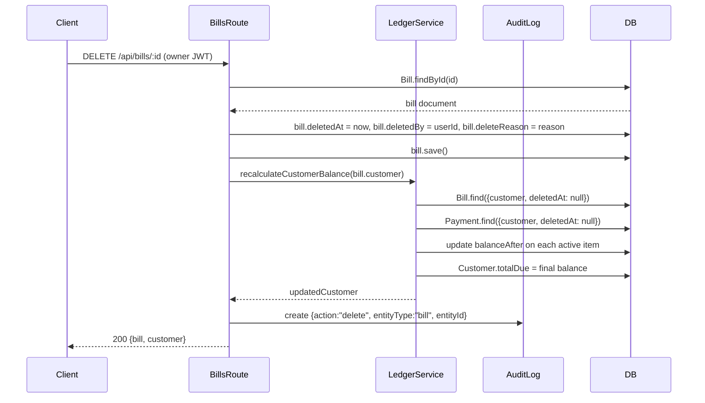
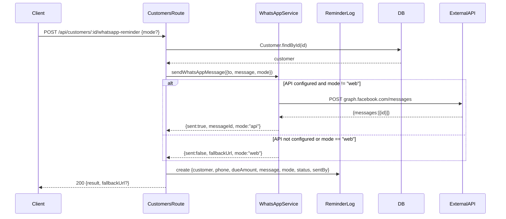
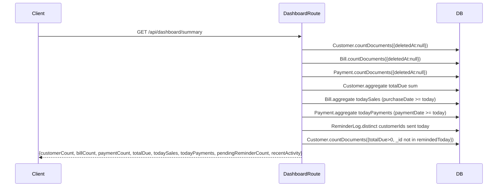

# Design Document: core-feature-completion

## Overview

This document covers the completion and extension of the billing/ledger management application (Krishi Credit). Four feature areas are in scope: dashboard completion (today's sales, today's payments, pending reminders), soft-delete with owner-only controls and ledger recalculation, WhatsApp reminder improvements (official API + browser `wa.me` fallback with a persisted reminder history), and an Admin Settings hub that consolidates owner-only management links.

The existing stack is Node.js/Express + MongoDB/Mongoose on the backend and React/Vite/Tailwind on the frontend. All new work follows the patterns already established: `asyncHandler` wrappers, `httpError` for error responses, `auditLogger` middleware for mutations, `authenticate`/`authorize` middleware for access control, and `recalculateCustomerBalance` from `ledgerService` for any ledger-affecting change.

---

## Architecture



---

## Sequence Diagrams

### Soft Delete — Bill



### WhatsApp Reminder — API + Fallback



### Dashboard Summary



---

## Components and Interfaces

### Backend: Soft Delete Middleware Pattern

All three models (Customer, Bill, Payment) gain the same three fields. Queries that list or process active records must filter `{ deletedAt: null }`. The `getLedgerItems` function in `ledgerService` is the single place that fetches bills and payments for balance calculation — it must be updated to exclude soft-deleted records.

**Soft Delete Fields (added to Customer, Bill, Payment schemas)**:
```javascript
deletedAt:    { type: Date,   default: null }
deletedBy:    { type: ObjectId, ref: "User", default: null }
deleteReason: { type: String, default: "" }
```

### Backend: ReminderLog Model

New Mongoose model persisting every reminder attempt.

```javascript
interface ReminderLog {
  customer:   ObjectId  // ref: Customer, required, indexed
  phone:      String    // snapshot of phone at send time
  dueAmount:  Number    // snapshot of totalDue at send time
  message:    String    // full message text
  mode:       "api" | "web"   // how it was sent
  status:     "sent" | "failed" | "fallback"
  fallbackUrl: String   // populated when mode == "web"
  sentBy:     ObjectId  // ref: User
  createdAt:  Date      // auto via timestamps
}
```

### Backend: Updated whatsappService

```javascript
// Returns one of three shapes:
interface WhatsAppResult {
  sent:        boolean
  mode:        "api" | "web"
  messageId?:  string       // present when mode == "api" and sent == true
  fallbackUrl?: string      // present when mode == "web"
  error?:      string       // present when sent == false and mode == "api"
}

sendWhatsAppMessage({ to, message, mode? }): Promise<WhatsAppResult>
```

`mode` values:
- `"api"` — force API path; error if not configured
- `"web"` — force browser fallback; skip API entirely
- `"auto"` (default) — use API if configured, otherwise fall back to `wa.me`

### Backend: Dashboard Route Extension

The existing `GET /api/dashboard/summary` response is extended:

```javascript
interface DashboardSummary {
  customerCount:        number
  billCount:            number
  paymentCount:         number
  totalDue:             number
  todaySales:           number   // NEW: sum of billAmount for bills created today
  todayPayments:        number   // NEW: sum of paidAmount for payments created today
  pendingReminderCount: number   // NEW: customers with totalDue > 0 and no reminder sent today
  recentActivity:       ActivityItem[]
}
```

### Backend: New Reminder Routes (`/api/reminders`)

```javascript
GET  /api/reminders          // owner only — paginated reminder history
GET  /api/reminders/pending  // owner only — customers with totalDue > 0 and no reminder today
```

### Frontend: Dashboard Cards

Three new stat cards added to the existing 4-card grid:
- Today's Sales (sum of bill amounts today)
- Today's Payments (sum of payment amounts today)
- Pending Reminders (count of customers needing a reminder)

### Frontend: CustomerProfile — Reminder Button

The existing WhatsApp button is extended to:
1. Accept a `mode` selector (API / Web / Auto) visible to owners
2. Show the last reminder status (sent / failed / fallback) below the button
3. When `fallbackUrl` is returned, open it in a new tab automatically

### Frontend: AdminSettings Page

New owner-only page at `/admin` with navigation cards linking to:
- Staff Accounts (`/users`)
- Audit Logs (`/audit-logs`)
- Reminder History (`/reminders`)
- Backup (deferred — shown as "Coming Soon")

---

## Data Models

### Customer (updated)

```javascript
{
  customerId:   String,   // unique, auto-generated
  name:         String,   // required
  phone:        String,   // required, unique
  address:      String,
  notes:        String,
  totalDue:     Number,   // maintained by ledgerService
  createdBy:    ObjectId,
  updatedBy:    ObjectId,
  // NEW soft-delete fields:
  deletedAt:    Date | null,
  deletedBy:    ObjectId | null,
  deleteReason: String
}
```

**Validation Rules**:
- Cannot delete when `totalDue > 0`
- `phone` must remain unique among non-deleted customers (existing unique index covers this since deleted records keep their phone value — the route must check only active customers on create/update)

### Bill (updated)

```javascript
{
  customer:     ObjectId,
  billNumber:   String,   // unique, auto-generated
  billAmount:   Number,
  paidAmount:   Number,
  paymentMode:  "cash" | "online",
  purchaseDate: Date,
  file:         ObjectId | null,
  balanceAfter: Number,
  createdBy:    ObjectId,
  updatedBy:    ObjectId,
  // NEW soft-delete fields:
  deletedAt:    Date | null,
  deletedBy:    ObjectId | null,
  deleteReason: String
}
```

### Payment (updated)

```javascript
{
  customer:     ObjectId,
  paidAmount:   Number,
  paymentMode:  "cash" | "online",
  paymentDate:  Date,
  balanceAfter: Number,
  notes:        String,
  createdBy:    ObjectId,
  updatedBy:    ObjectId,
  // NEW soft-delete fields:
  deletedAt:    Date | null,
  deletedBy:    ObjectId | null,
  deleteReason: String
}
```

### ReminderLog (new)

```javascript
{
  customer:    ObjectId,   // required, indexed
  phone:       String,     // required
  dueAmount:   Number,     // required
  message:     String,     // required
  mode:        String,     // enum: ["api", "web"]
  status:      String,     // enum: ["sent", "failed", "fallback"]
  fallbackUrl: String,     // default ""
  sentBy:      ObjectId,   // ref: User
  createdAt:   Date        // auto
}
```

### AuditLog (updated enum)

The `action` enum gains `"restore"` to complement `"delete"`:

```javascript
action: { type: String, enum: ["create", "update", "delete", "restore"] }
```

---

## Algorithmic Pseudocode

### Soft Delete — Customer

```pascal
PROCEDURE softDeleteCustomer(customerId, userId, reason)
  INPUT: customerId, userId, reason
  OUTPUT: deletedCustomer

  SEQUENCE
    customer ← Customer.findById(customerId)
    IF customer IS NULL THEN
      THROW httpError(404, "Customer not found")
    END IF

    IF customer.deletedAt IS NOT NULL THEN
      THROW httpError(409, "Customer is already deleted")
    END IF

    IF customer.totalDue > 0 THEN
      THROW httpError(400, "Cannot delete customer with outstanding dues")
    END IF

    customer.deletedAt    ← now()
    customer.deletedBy    ← userId
    customer.deleteReason ← reason
    customer.save()

    AuditLog.create({
      entityType: "customer",
      entityId:   customerId,
      action:     "delete",
      changedBy:  userId
    })

    RETURN customer
  END SEQUENCE
END PROCEDURE
```

**Preconditions:**
- Caller has `owner` role (enforced by `authorize("owner")` middleware)
- `customerId` is a valid ObjectId

**Postconditions:**
- `customer.deletedAt` is set to current timestamp
- An audit log entry with `action: "delete"` exists
- Customer is excluded from all active queries (`deletedAt: null` filter)

**Loop Invariants:** N/A

---

### Soft Delete — Bill or Payment

```pascal
PROCEDURE softDeleteLedgerItem(model, itemId, userId, reason)
  INPUT: model (Bill | Payment), itemId, userId, reason
  OUTPUT: {item, updatedCustomer}

  SEQUENCE
    item ← model.findById(itemId)
    IF item IS NULL THEN
      THROW httpError(404, "Not found")
    END IF

    IF item.deletedAt IS NOT NULL THEN
      THROW httpError(409, "Already deleted")
    END IF

    item.deletedAt    ← now()
    item.deletedBy    ← userId
    item.deleteReason ← reason
    item.save()

    updatedCustomer ← recalculateCustomerBalance(item.customer)

    AuditLog.create({
      entityType: model name,
      entityId:   itemId,
      action:     "delete",
      changedBy:  userId
    })

    RETURN {item, updatedCustomer}
  END SEQUENCE
END PROCEDURE
```

**Preconditions:**
- Caller has `owner` role
- `itemId` is a valid ObjectId for the given model

**Postconditions:**
- `item.deletedAt` is set
- `customer.totalDue` reflects the recalculated balance excluding the deleted item
- All remaining active ledger items have correct `balanceAfter` values
- Audit log entry created

---

### Ledger Recalculation (updated)

The existing `getLedgerItems` and `recalculateCustomerBalance` functions must filter out soft-deleted records:

```pascal
PROCEDURE getLedgerItems(customerId)
  INPUT: customerId
  OUTPUT: sorted array of active ledger items

  SEQUENCE
    bills    ← Bill.find({ customer: customerId, deletedAt: null })
    payments ← Payment.find({ customer: customerId, deletedAt: null })

    items ← merge bills and payments with type, date, dueChange fields
    RETURN items.sort(byLedgerOrder)
  END SEQUENCE
END PROCEDURE
```

**Postconditions:**
- Only non-deleted bills and payments are included
- Items are sorted by date then createdAt (existing `byLedgerOrder` comparator)

---

### WhatsApp Reminder with Fallback

```pascal
PROCEDURE sendWhatsAppMessage({to, message, mode})
  INPUT: to (phone string), message (string), mode ("api"|"web"|"auto")
  OUTPUT: WhatsAppResult

  SEQUENCE
    isApiConfigured ← WHATSAPP_TOKEN IS NOT NULL AND WHATSAPP_PHONE_NUMBER_ID IS NOT NULL

    IF mode = "web" OR (mode = "auto" AND NOT isApiConfigured) THEN
      encodedMsg  ← encodeURIComponent(message)
      fallbackUrl ← "https://wa.me/" + to + "?text=" + encodedMsg
      RETURN { sent: false, mode: "web", fallbackUrl }
    END IF

    // API path
    response ← fetch(apiEndpoint, { method: "POST", body: messagePayload })

    IF response.ok THEN
      RETURN { sent: true, mode: "api", messageId: response.messages[0].id }
    ELSE
      error ← new Error("WhatsApp message failed")
      error.details ← response.json()
      THROW error
    END IF
  END SEQUENCE
END PROCEDURE
```

**Preconditions:**
- `to` is a digits-only phone string
- `message` is non-empty

**Postconditions:**
- If `mode == "web"` or API not configured: returns `fallbackUrl`, no external call made
- If API call succeeds: returns `messageId`
- If API call fails: throws error with status 502

---

### Pending Reminder Count

```pascal
PROCEDURE getPendingReminderCount()
  INPUT: none
  OUTPUT: count (integer)

  SEQUENCE
    todayStart ← start of current calendar day (UTC midnight)

    remindedCustomerIds ← ReminderLog.distinct("customer", {
      createdAt: { $gte: todayStart }
    })

    count ← Customer.countDocuments({
      totalDue:  { $gt: 0 },
      deletedAt: null,
      _id:       { $nin: remindedCustomerIds }
    })

    RETURN count
  END SEQUENCE
END PROCEDURE
```

**Preconditions:** None

**Postconditions:**
- Returns the number of active customers with outstanding dues who have not received any reminder today
- Count decreases by 1 after a successful reminder is sent to a previously un-reminded customer

---

### Restore Customer

```pascal
PROCEDURE restoreCustomer(customerId, userId)
  INPUT: customerId, userId
  OUTPUT: restoredCustomer

  SEQUENCE
    customer ← Customer.findById(customerId)
    IF customer IS NULL THEN
      THROW httpError(404, "Customer not found")
    END IF

    IF customer.deletedAt IS NULL THEN
      THROW httpError(409, "Customer is not deleted")
    END IF

    customer.deletedAt    ← null
    customer.deletedBy    ← null
    customer.deleteReason ← ""
    customer.save()

    AuditLog.create({
      entityType: "customer",
      entityId:   customerId,
      action:     "restore",
      changedBy:  userId
    })

    RETURN customer
  END SEQUENCE
END PROCEDURE
```

**Preconditions:**
- Caller has `owner` role
- Customer exists and `deletedAt` is not null

**Postconditions:**
- `customer.deletedAt` is null
- Customer appears in active customer queries
- Audit log entry with `action: "restore"` exists

---

## Key Functions with Formal Specifications

### `softDeleteCustomer(req, res)` — customers.routes.js

```javascript
DELETE /api/customers/:id
authorize("owner")
```

**Preconditions:**
- `req.user.role === "owner"`
- `req.params.id` is a valid MongoDB ObjectId
- Customer exists and `deletedAt === null`
- `customer.totalDue === 0`

**Postconditions:**
- `customer.deletedAt` is set to current Date
- `customer.deletedBy === req.user._id`
- AuditLog entry created with `action: "delete"`, `entityType: "customer"`
- Response: `200 { customer }`

**Error cases:**
- 404 if customer not found
- 409 if already deleted
- 400 if `totalDue > 0`

---

### `softDeleteBill(req, res)` — bills.routes.js

```javascript
DELETE /api/bills/:id
authorize("owner")
```

**Preconditions:**
- `req.user.role === "owner"`
- Bill exists and `deletedAt === null`

**Postconditions:**
- `bill.deletedAt` set, `bill.deletedBy` set
- `recalculateCustomerBalance(bill.customer)` called — `customer.totalDue` updated
- All active ledger items for that customer have correct `balanceAfter`
- AuditLog entry created
- Response: `200 { bill, customer }`

---

### `softDeletePayment(req, res)` — payments.routes.js

```javascript
DELETE /api/payments/:id
authorize("owner")
```

Same postconditions as `softDeleteBill` but for a payment record.

---

### `sendReminderWithFallback(req, res)` — customers.routes.js

```javascript
POST /api/customers/:id/whatsapp-reminder
authorize("owner", "staff")
Body: { message?, mode? }
```

**Preconditions:**
- Customer exists and `deletedAt === null`
- `customer.phone` is non-empty

**Postconditions:**
- `ReminderLog` document created with correct `mode`, `status`, `sentBy`, `dueAmount`
- If `mode === "api"` and API configured: `status === "sent"`, `messageId` present in response
- If `mode === "web"` or API not configured: `status === "fallback"`, `fallbackUrl` present in response
- Response: `200 { result: WhatsAppResult }`

---

### `getDashboardSummary(req, res)` — dashboard.routes.js

```javascript
GET /api/dashboard/summary
authenticate (any role)
```

**Preconditions:** Valid JWT

**Postconditions:**
- All counts exclude soft-deleted records (`deletedAt: null`)
- `todaySales` = sum of `billAmount` for bills with `purchaseDate >= todayStart` and `deletedAt: null`
- `todayPayments` = sum of `paidAmount` for payments with `paymentDate >= todayStart` and `deletedAt: null`
- `pendingReminderCount` = count of active customers with `totalDue > 0` not reminded today
- Response includes all existing fields plus the three new fields

---

## Example Usage

### Soft Delete a Bill

```javascript
// Owner deletes a bill
const response = await api.delete(`/bills/${billId}`, {
  data: { deleteReason: "Entered by mistake" }
});
// response.data = { bill: { ...billFields, deletedAt: "2024-01-15T..." }, customer: { totalDue: 450 } }
```

### Send WhatsApp Reminder with Fallback

```javascript
// Auto mode — uses API if configured, falls back to wa.me link
const { data } = await api.post(`/customers/${customerId}/whatsapp-reminder`, {
  mode: "auto"
});

if (data.result.fallbackUrl) {
  window.open(data.result.fallbackUrl, "_blank", "noopener,noreferrer");
}
// data.result = { sent: false, mode: "web", fallbackUrl: "https://wa.me/919876543210?text=..." }
```

### Dashboard Summary Response

```javascript
// GET /api/dashboard/summary
{
  customerCount: 142,
  billCount: 891,
  paymentCount: 634,
  totalDue: 287500,
  todaySales: 12400,       // NEW
  todayPayments: 8200,     // NEW
  pendingReminderCount: 23, // NEW
  recentActivity: [...]
}
```

### Restore a Deleted Customer

```javascript
// Owner restores a previously deleted customer
const { data } = await api.post(`/customers/${customerId}/restore`);
// data.customer.deletedAt === null
```

---

## Correctness Properties

1. **Ledger integrity after soft delete**: For any customer C, after soft-deleting any bill or payment belonging to C, `C.totalDue` equals the running balance computed from all non-deleted bills and payments sorted by `(date, createdAt)`.

2. **Delete guard**: A customer with `totalDue > 0` can never be soft-deleted. The endpoint must return HTTP 400 in this case.

3. **Idempotent soft delete rejection**: Attempting to soft-delete an already-deleted record returns HTTP 409, not 200.

4. **Restore idempotency**: Attempting to restore a non-deleted customer returns HTTP 409.

5. **Pending reminder count monotonicity**: After sending a reminder to customer C (who had no reminder today), `pendingReminderCount` decreases by exactly 1 if `C.totalDue > 0`, or stays the same if `C.totalDue === 0`.

6. **Fallback URL correctness**: When `mode === "web"`, the returned `fallbackUrl` must match the pattern `https://wa.me/{digitsOnlyPhone}?text={encodedMessage}` and no external HTTP call is made.

7. **Audit completeness**: Every soft-delete and restore operation produces exactly one AuditLog entry with the correct `action`, `entityType`, `entityId`, and `changedBy`.

8. **Dashboard counts exclude deleted records**: `customerCount`, `billCount`, and `paymentCount` in the dashboard summary never include records where `deletedAt` is non-null.

---

## Error Handling

### Scenario 1: Delete customer with outstanding dues

**Condition**: `DELETE /api/customers/:id` called when `customer.totalDue > 0`
**Response**: HTTP 400 `{ message: "Cannot delete customer with outstanding dues" }`
**Recovery**: Caller must first record payments to clear the balance

### Scenario 2: WhatsApp API failure

**Condition**: API is configured but the external call returns a non-2xx status
**Response**: HTTP 502 `{ message: "WhatsApp message failed", details: {...} }`
**Recovery**: Frontend should offer the `wa.me` fallback link; a `ReminderLog` entry with `status: "failed"` is created before throwing

### Scenario 3: Soft delete already-deleted record

**Condition**: `deletedAt` is already set on the target document
**Response**: HTTP 409 `{ message: "Already deleted" }`
**Recovery**: No action needed; caller should refresh state

### Scenario 4: Restore non-deleted record

**Condition**: `POST /api/customers/:id/restore` called when `deletedAt === null`
**Response**: HTTP 409 `{ message: "Customer is not deleted" }`
**Recovery**: No action needed

### Scenario 5: Staff attempts owner-only action

**Condition**: Staff user calls `DELETE /api/customers/:id`, `DELETE /api/bills/:id`, `DELETE /api/payments/:id`, or `POST /api/customers/:id/restore`
**Response**: HTTP 403 `{ message: "You do not have permission to perform this action" }`
**Recovery**: No action; UI should hide these controls for staff

---

## Testing Strategy

### Unit Testing Approach

- `ledgerService.getLedgerItems`: verify that soft-deleted bills and payments are excluded from the returned array
- `ledgerService.recalculateCustomerBalance`: verify `totalDue` and per-item `balanceAfter` values after a mix of active and deleted records
- `whatsappService.sendWhatsAppMessage`: verify fallback URL format when API is not configured; verify API path when env vars are set (mock `fetch`)
- `getPendingReminderCount`: verify count decreases after inserting a `ReminderLog` for a customer with `totalDue > 0`

### Property-Based Testing Approach

**Property Test Library**: fast-check

- **Ledger balance property**: For any sequence of bill and payment operations (including soft deletes), `customer.totalDue` always equals the sum of `(billAmount - paidAmount)` for active bills minus the sum of `paidAmount` for active payments, clamped to ≥ 0.
- **Delete guard property**: For any customer with `totalDue > 0`, the soft-delete endpoint always returns a non-2xx status.
- **Fallback URL property**: For any non-empty phone string and message, the generated `fallbackUrl` always starts with `https://wa.me/` and contains the URL-encoded message.

### Integration Testing Approach

- Full flow: create customer → add bill → add payment → soft-delete bill → verify `totalDue` recalculated → restore not applicable (bill restore not in scope) → verify audit log entries
- Reminder flow: send reminder via API mode → verify `ReminderLog` created with `status: "sent"` → send again → verify `pendingReminderCount` unchanged for that customer
- Dashboard: create bill and payment today → verify `todaySales` and `todayPayments` reflect correct sums → send reminder → verify `pendingReminderCount` decreases

---

## Performance Considerations

- The `pendingReminderCount` query involves a `distinct` on `ReminderLog` followed by a `countDocuments` with `$nin`. For large deployments, add a compound index on `ReminderLog(customer, createdAt)` and `Customer(totalDue, deletedAt)`.
- All soft-delete queries add a `deletedAt: null` filter. Add a sparse index on `deletedAt` for each model to keep these queries fast as the dataset grows.
- The dashboard summary runs 7–8 parallel queries. This is acceptable for the current scale; if latency becomes an issue, a Redis-cached summary with a 60-second TTL is the natural next step.
- `recalculateCustomerBalance` iterates all active ledger items for a customer. For customers with hundreds of transactions this is still fast (single-customer scope), but a MongoDB session/transaction should wrap the read-update cycle to prevent race conditions on concurrent bill/payment creation.

---

## Security Considerations

- All soft-delete and restore endpoints are gated behind `authorize("owner")`. Staff cannot delete or restore any record.
- `deleteReason` is stored as plain text; it is not rendered as HTML anywhere, so XSS is not a concern, but it should be trimmed and length-limited (max 500 chars) to prevent oversized payloads.
- The `wa.me` fallback URL is constructed server-side from the customer's stored phone number and a server-generated message. The `mode` field from the client is validated against the enum `["api", "web", "auto"]` before use.
- `ReminderLog` records are read-only after creation (no update/delete endpoints). This preserves an immutable audit trail of all reminder activity.
- The `WHATSAPP_TOKEN` is read from `backend/.env` and never returned to the client in any API response.

---

## Dependencies

| Dependency | Already Present | Purpose |
|---|---|---|
| `mongoose` | ✅ | New `ReminderLog` model |
| `express` | ✅ | New `/api/reminders` router |
| `jsonwebtoken` / auth middleware | ✅ | `authorize("owner")` on delete/restore routes |
| `fast-check` | ❌ (add to devDependencies) | Property-based tests |
| WhatsApp Graph API | ✅ (env vars) | Official API path in `whatsappService` |
| `wa.me` deep link | ✅ (no dep needed) | Browser fallback — URL construction only |
